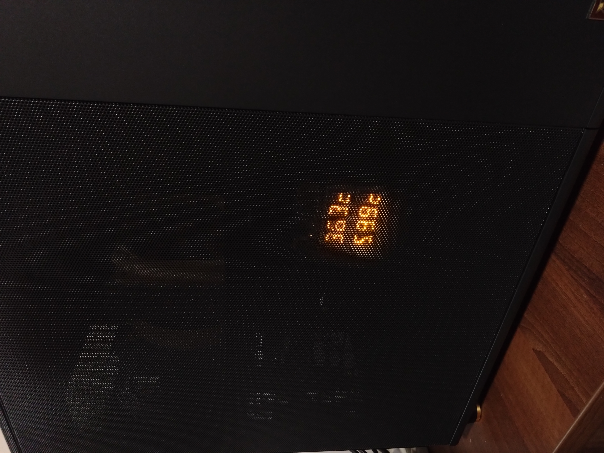

# pc-thermal-display

This project is for displaying CPU and GPU thermals on two 14-segment displays.
The hardware used is Adafruit Feather M4 Express, and the displays are
Adafruit 0.54" Quad Alphanumeric FeatherWings.

The software consists of a simple Arduino program reading serial input and writing
it to the displays, and a .NET project using System.IO.Ports and LibreHardwareMonitor.
The C# program may need to be run as admin  in order to retrieve the temperatures.

Here's a picture of the board installed within the PC

Here's the display with the software in action
